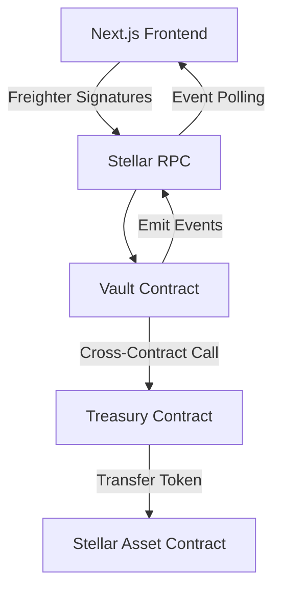

# StellarVault 🚀

A production-style collaborative savings and escrow dApp built on the Stellar network using Soroban Smart Contracts and Next.js.

## Table of Contents
1. [Project Description](#project-description)
2. [Problem Statement](#problem-statement)
3. [Solution](#solution)
4. [Features](#features)
5. [Architecture](#architecture)
6. [Technology Stack](#technology-stack)
7. [Smart Contract Architecture](#smart-contract-architecture)
8. [Repository Structure](#repository-structure)
9. [Local Setup & Prerequisites](#local-setup--prerequisites)
10. [Testing](#testing)
11. [Deployment](#deployment)
12. [CI/CD](#cicd)
13. [Security & Limitations](#security--limitations)
14. [Demo & Screenshots](#demo--screenshots)

## Project Description
StellarVault is an advanced Level 3 hackathon project demonstrating complex on-chain state management, cross-contract interactions, and real-time event streaming on the Stellar Testnet. 

## Problem Statement
Traditional escrow and collaborative savings mechanisms rely on trusted third parties, causing high fees, slow execution times, and single points of failure. Most existing blockchain alternatives lack user-friendly interfaces or real-time responsiveness, making them difficult for non-technical users to trust and utilize.

## Solution
StellarVault decentralizes the escrow and shared-savings process. Using dual Soroban smart contracts, users can securely pool funds. Withdrawals require explicit on-chain multi-signature consensus among the vault participants, ensuring that no single actor can unilaterally drain the funds. The frontend provides a premium, real-time experience using Stellar RPC event streaming.

## Features
- **Multi-Party Vaults:** Create vaults with an unlimited number of authorized participants.
- **Consensus Withdrawals:** Withdrawal requests remain locked until all participants explicitly approve them on-chain.
- **Cross-Contract Security:** The primary Vault logic is decoupled from the Treasury holding the assets, minimizing the attack surface.
- **Real-Time Feeds:** The UI listens to live Soroban events, updating balances and dashboards instantly without page reloads.
- **Wallet Integration:** Native integration with Freighter for secure transaction signing.

## Architecture


*See [docs/architecture.md](docs/architecture.md) for more details.*

## Technology Stack
- **Smart Contracts:** Rust, Soroban SDK, Stellar CLI
- **Frontend:** Next.js 14 (App Router), React, TypeScript
- **Styling:** Vanilla CSS (Glassmorphism design system)
- **Blockchain Interaction:** `@stellar/stellar-sdk`, `@stellar/freighter-api`
- **Testing:** `cargo test` (Rust), `vitest` (React)
- **CI/CD:** GitHub Actions

## Smart Contract Architecture
The backend uses a dual-contract setup:
1. **Vault Contract:** Acts as the brain. Tracks participants, balances, and multi-sig withdrawal requests. It applies business logic and enforces authorization rules.
2. **Treasury Contract:** Acts as the vault door. It physically holds the tokens and only releases them when invoked directly by the Vault contract.

**Inter-contract Communication Flow:**
When a withdrawal is fully approved, a user calls `Vault::execute_withdrawal`. The Vault verifies consensus, updates its state, and then synchronously invokes `Treasury::release` via a `Client` interface, which transfers the assets out.

## Repository Structure
```
stellar-vault/
├── contracts/
│   ├── vault/          # Vault logic and state tracker
│   └── treasury/       # Secure token storage
├── frontend/           # Next.js React application
├── scripts/            # Deployment and utility scripts
├── docs/               # Architecture and testing documentation
└── .github/workflows/  # CI/CD pipeline configuration
```

## Local Setup & Prerequisites

### Prerequisites
- Node.js v20+
- Rust (stable) and `wasm32-unknown-unknown` target
- Stellar CLI (`cargo install --locked stellar-cli`)
- Freighter Wallet browser extension

### Environment Variables
Copy `.env.example` in the frontend directory:
```bash
cp frontend/.env.example frontend/.env.local
```
Ensure you have the deployed contract IDs populated inside `.env.local`.

### Running Locally
```bash
cd frontend
npm install
npm run dev
```
Navigate to `http://localhost:3000`.

## Testing
Run the complete test suite locally:

**Smart Contracts:**
```bash
cargo test --workspace
```
**Frontend:**
```bash
cd frontend
npx vitest run
```
*See [docs/testing.md](docs/testing.md) for strategy details.*

## Deployment
To deploy your own instance to Testnet:
```bash
chmod +x scripts/deploy.sh
./scripts/deploy.sh
```

### Live Testnet Contract Addresses
- **Vault Contract:** `CDPTEKB44IWV2Z5CIXZYKJYV7YP76MOTYTD5W5NSQQIRXSMSDPEH765X`
- **Treasury Contract:** `CAS346MW4MUEOKQ6LHB2C5RFAOUDNY3B3NZS5XAYYI2BTFGIVP5UXXST`
- **Test Token (XLM):** `CDLZFC3SYJYDZT7K67VZ75HPJVIEUVNIXF47ZG2FB2RMQQVU2HHGCYSC`

**Example Transaction Hash (Vault Creation):** 
`a0f6019f354ec11e38948b115138fd785d706b80d8653e9c4a3f68d7c363da9b`

*See [docs/deployment.md](docs/deployment.md) for full deployment logs.*

## CI/CD
StellarVault utilizes GitHub Actions for continuous integration. On every push to `main`, the pipeline:
1. Formats and compiles the optimized WASM targets.
2. Runs the Rust test suite.
3. Installs frontend dependencies.
4. Enforces strict TypeScript typechecking and linting.
5. Runs the Vitest frontend suite and performs a Next.js production build.

## Security & Limitations

**Security Considerations:**
- The Vault contract implements the Checks-Effects-Interactions (CEI) pattern to prevent state inconsistencies during cross-contract calls.
- Strict `require_auth()` barriers are placed on all state-mutating functions.

**Known Limitations:**
- Unoptimized Storage: Adding thousands of participants to a single vault might hit read/write ledger limits.
- The UI currently requires manual refresh for deep nested states (though global events auto-update).

## Future Improvements
- Implement a true Soroban token rather than relying on native XLM SAC.
- Support threshold multi-signatures (e.g., 2-of-3) rather than unanimous consensus.

## Demo & Screenshots
**Demo Link:** [Insert YouTube/Loom Link Here]

**Screenshots:**
*[Insert Dashboard Screenshot Here]*
*[Insert Create Vault Screenshot Here]*
