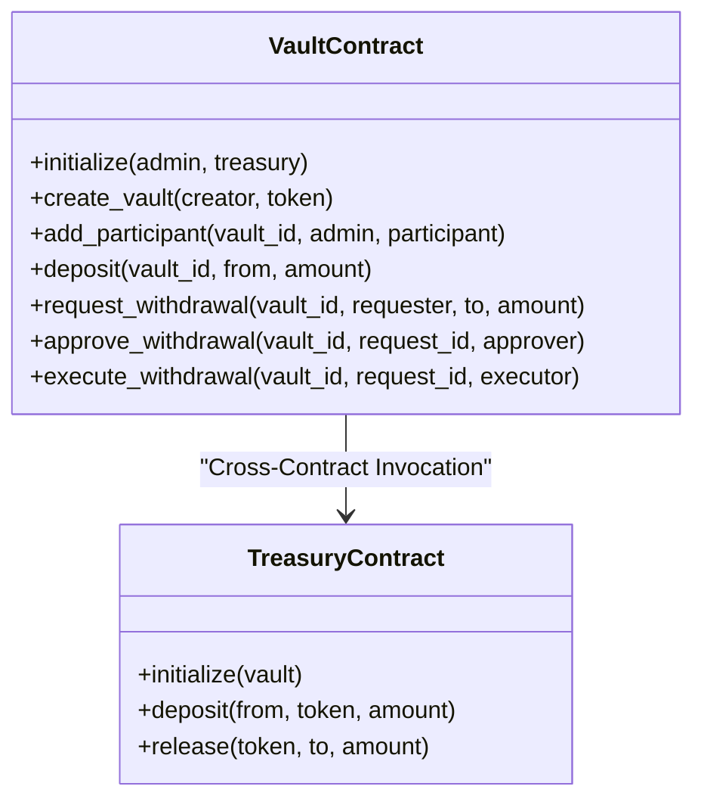
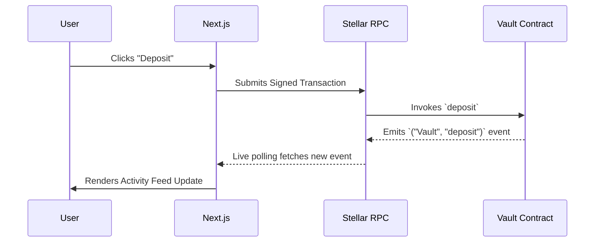

# StellarVault Architecture

## Overview
StellarVault uses a dual-contract architecture designed for security, separation of concerns, and robust inter-contract communication.

## Dual Contract Design

### 1. Vault Contract (Logic Layer)
The Vault acts as the brain. It contains no actual tokens. Instead, it tracks the state of the system using persistent Soroban storage.
- **State Tracked:** Vault balances, participant rosters, withdrawal request multi-sig statuses.
- **Authorization:** Ensures that only verified participants can approve withdrawals.

### 2. Treasury Contract (Asset Layer)
The Treasury acts as the physical vault. It interfaces directly with Stellar Asset Contracts (SACs) to hold and move tokens.
- **Security Barrier:** The `release` function enforces a strict `vault.require_auth()` check. It can *only* be commanded by the trusted Vault contract.

## Event Streaming Architecture
StellarVault embraces an event-driven frontend architecture. 

When mutations occur, the contracts emit labeled events (e.g., `vault_created`, `withdrawal_executed`). The Next.js frontend uses a custom `useStellarEvents` hook to continuously poll the RPC endpoint, parse the XDR event structures, and update the UI in real-time.
