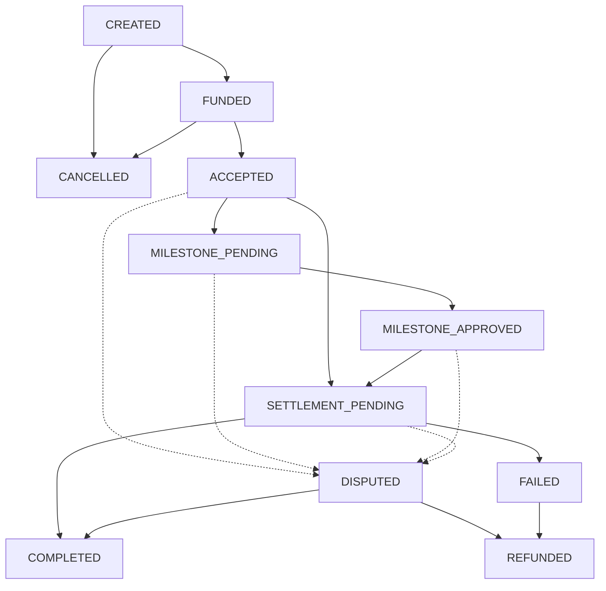

# FlowPay Domain Model & Architecture

## Overview
FlowPay is a programmable cross-border payout platform built on Stellar. It enables businesses to execute milestone-based, conditional payouts to international recipients. The platform bridges the gap between smart contract escrow logic and traditional payout rails (via Anchor integrations like SEP-24/SEP-31).

## Core Entities

1. **User (Business / Recipient)**
   Represents the identity of the actors. 
   - **Business:** The entity funding the payout.
   - **Recipient:** The payee receiving the funds.
   - Tied by their Stellar Wallet Address (`G...`).

2. **Payment**
   The core state machine. Represents a single programmable payout.
   - Contains references to participants, amount, asset, and milestones.
   - Governed by strict state transition rules.

3. **Milestone**
   Optional conditions attached to a payment. 
   - A payment cannot transition to `SETTLEMENT_PENDING` until all attached milestones are approved by the payer (Business).

4. **Settlement**
   The record of final execution. In a production environment, this tracks the off-ramp execution provided by a Stellar Anchor.

5. **PaymentEvent & Transaction**
   Immutable ledgers of state changes and on-chain transaction hashes providing transparency and auditability.

## Payment Lifecycle

FlowPay enforces the following strict state machine:

1. `CREATED`: The business defines the payout terms (amount, recipient, milestones).
2. `FUNDED`: The business locks the funds in the Treasury contract.
3. `ACCEPTED`: The recipient connects their wallet and accepts the payout terms.
4. `MILESTONE_PENDING`: (Optional) The recipient is actively working on the required conditions.
5. `MILESTONE_APPROVED`: The business approves the milestone.
6. `SETTLEMENT_PENDING`: The funds are unlocked and ready for off-ramp / anchor withdrawal.
7. `COMPLETED`: The funds have successfully reached the recipient.

**Failure / Edge Cases:**
- `CANCELLED`: The business cancels the payout before it is funded or accepted.
- `DISPUTED`: Disagreement on milestone completion.
- `REFUNDED`: Funds returned to the business.
- `FAILED`: Anchor settlement failure.

## Valid State Transitions

The smart contract and frontend strictly enforce these pathways to prevent invalid states (e.g., refunding a completed payout).

## MVP User Journeys

### Business Journey (Payer)
1. **Connect Wallet:** Authenticate via Freighter.
2. **Create Payment:** Define recipient G-address, amount, asset (e.g., USDC), and optional milestones.
3. **Fund Payment:** Sign a transaction to lock funds in the Treasury contract.
4. **Track Payment:** Monitor the dashboard to see when the recipient accepts.
5. **Approve Milestone:** Review work and sign approval transaction.
6. **Completion:** View settlement receipt once the anchor processes the payout.

### Recipient Journey (Payee)
1. **Connect Wallet:** Authenticate via Freighter.
2. **View Payment Details:** Review the terms and milestones set by the business.
3. **Accept Payment:** Sign a transaction to accept the terms.
4. **Submit Milestone:** Mark the milestone as ready for review.
5. **Track Settlement:** Watch the state transition to `SETTLEMENT_PENDING` and finally `COMPLETED`.

## Anchor Integration Strategy (Level 4 Boundary)
For the MVP, we will not integrate a live SEP-31 anchor to avoid fabricating dependencies. Instead, the `SETTLEMENT_PENDING` state acts as the integration boundary. 
- In production, this state triggers an API call to an Anchor.
- For the MVP, this state will be clearly demarcated as the "Anchor Handoff" point, and we will provide a simulated settlement button (representing the anchor callback) to transition the state to `COMPLETED`.
